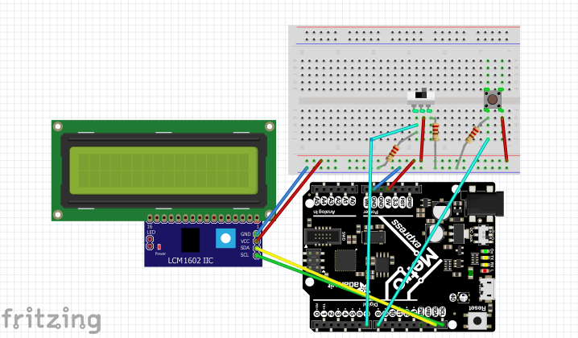

# CircuitPython

## Table of Contents
* [Table of Contents](#TableOfContents)
* [Blink Led](#Blink_Led_CircuitPython)
* [CircuitPython_Servo](#CircuitPython_Servo)
* [CircuitPython_Distance LED](#CircuitPython_Distance_LED)
* [Photointurrupter](#Photointurrupter)
* [CircuitPython_LCD](#CircuitPython_LCD)
---

## Blink_Led_CircuitPython

### Description & Code
I had to make code in Mu that would make the Metro Express neopixel change colors. [This website](https://www.w3schools.com/colors/colors_picker.asp) was a great source because it had all the codes for lots of different colors. 


``` python
import board
import neopixel
import time

dot = neopixel.NeoPixel(board.NEOPIXEL, 1)

while True:
    dot.brightness = (.1)   # Saves the led, makes it less bright
    
    
    print("Make it red!")   
    dot.fill((255, 51, 0))  # Tells the led to fade through the color red
    time.sleep(.5)          # Makes the led wait before moving to the next color
    print("Make it dark blue!")
    dot.fill((0, 0, 102))
    time.sleep(.5)
    print("Make it fuscia!") # Command for the individual color
    dot.fill((204, 0, 102))
    time.sleep(.5)
    print("Make it yellow!")
    dot.fill((255, 255, 0))
    time.sleep(.5)
```


### Evidence


### Reflection
The led was changing too fast in the beginning that I could barely tell it was changing, so I made the time.sleep (.5) seconds long so you could see each color fully before it switched to the next. It was easy to add more colors once you got the first 2 running, you would just copy the above code format, and then change the color you have written and the numbers for the color calibration. 


## CircuitPython_Servo

### Description & Code
I had to code the servo to turn 180 degrees repeatedly. 

```python
import board
import pwmio
from adafruit_motor import servo

# create a PWMOut object on Pin A2.
pwm = pwmio.PWMOut(board.A2, duty_cycle=2 ** 15, frequency=50)

# Create a servo object, my_servo.
my_servo = servo.Servo(pwm)

while True:
    for angle in range(0, 180, 5):  # 0 - 180 degrees, 5 degrees at a time. # make servo turn 180 degrees, in increments of 5 degrees
        my_servo.angle = angle
        time.sleep(0.05)
    for angle in range(180, 0, -5): # 180 - 0 degrees, 5 degrees at a time. # make servo turn back 180 degrees, in increments of 5 degrees
        my_servo.angle = angle
        time.sleep(0.05)
```

### Evidence


### Reflection

I didn't realize the different colors of the motor had designated spots in the Metro. The red wire goes to 5V, the blue wire goes to GND , and the yellow wire goes to A2. Once I had the wires in the right spots, the servo started turning right. 


## CircuitPython_Distance_LED

### Description & Code
The neopixel needs to change colors according to the distance measured by the servo. For values between 0 and 20 the color is red, values between 20 and 35 are blue, and for any value greater than 35 the color is green. 

```python
import time
import board
import adafruit_hcsr04
import neopixel
import simpleio

sonar = adafruit_hcsr04.HCSR04(trigger_pin=board.D5, echo_pin=board.D6)
cm = 0

dot = neopixel.NeoPixel(board.NEOPIXEL, 1)
dot.brightness = (.1)

while True:
    try:
        cm = sonar.distance
        print((cm,))
        
        if cm < 20:  # when the object is under 20 cm away, the led is red
            print("red")
            r = simpleio.map_range(cm, 5, 20, 255, 0)
            g = 0
            b = 0
            
            time.sleep(0.1)

        if cm > 20 and cm < 35: # for all distance values between 20 and 35 the led will be blue
            print("blue")
            time.sleep(0.1)
            r = 0
            g = 0
            b = simpleio.map_range(cm, 0, 20, 255, 0)
            
        if cm > 35:  # for all distance values greater than 35 cm, led will be green
            print("green")
            time.sleep(0.1)
            r = 0
            g = simpleio.map_range(cm, 20, 30, 0, 255)
            b = 0
        dot.fill((r, g, b)) # the order of led colors and values

    except RuntimeError:
        print("Retrying!")
    time.sleep(0.1) 

```

### Evidence


### Reflection
This assignment was more complicated than previous ones for me. Using simpleio made the color changing work, and earlier I had been using dot.fill but that was required determining dot and simpleio just made sense and worked. simpleio.map_range(x, in_min, in_max, out_min, out_max) is what I used, but replaced x with cm, because that was what I am using to determine distance and that is what determines the color change. The values where the color changes goes in for in_max or min, and the neopixel number (255) goes in for out_min or max. [I downloaded this to my lib folder so I could use simpleio.](https://circuitpython.readthedocs.io/projects/simpleio/en/latest/_modules/simpleio.html#map_range)


## Photointurrupter

### Description & Code

I had to make the code tell when the photointerrupter was interrupted. The red light on the side of the t interrupter would go out when it was interrupted, and if it was red then I had it wired correctly. 


``` python
photo = False
state = False

max = 4
start = time.time()
while True:
    photo = interrupter.value
    if photo and not state:
            counter += 1
    state = photo

    remaining = max - time.time()

    if remaining <= 0:
        print("The number of interrupts is :", str(counter))
        max = time.time() + 4
        counter = 0

```

### Evidence


### Reflection

The code I grabbed was originally from user gventr04 on github. At first I had my wiring wrong because the OUT was put in an Analog Input instead of a Digital input. You CANNOT let the + or L outputs touch OUT or (-). You should connect the + and L outputs by either soldering or using tape or a metal clip to put them together. I had them soldered together which is the easiest in my opinion. 


## CircuitPython_LCD


### Description & Code

The goal was to make the code tell when the photointerrupter was interrupted. If wired correctly, the red light to the side of the interrupter would go out when it was inturrupted. 


``` python
from lcd.lcd import LCD
from lcd.i2c_pcf8574_interface import I2CPCF8574Interface
import digitalio
import board
import time
from lcd.lcd import CursorMode

# Talk to the LCD at I2C address 0x27.
# The number of rows and columns defaults to 2x16, so those
# arguments could be omitted in this case.
lcd = LCD(I2CPCF8574Interface(0x27), num_rows=2, num_cols=16)

lcd.clear()

lcd.print("Switch State:")
lcd.set_cursor_pos(0, 0)


button_a = digitalio.DigitalInOut(board.D2)
button_a.direction = digitalio.Direction.INPUT
button_a.pull = digitalio.Pull.DOWN

counter = 0
while True:
    if button_a.value:
        counter += 1
        lcd.set_cursor_pos(1, 4)
        lcd.print(str(counter))
        time.sleep(0.1)
    else:
        counter = counter
        time.sleep(0.1)
```

Code credit to [aniyahmoore28](https://github.com/aniyahmoore28)

### Wiring Diagram




[Link to Abby Paquet's diagram](https://github.com/Apaquet37/CircuitPython/blob/master/Media/Final%20LCD%20screen%20fritzing%20diagram%20image.png)


### Reflection

The diagram I grabbed was from Abby Paquet because I thought it did a good job of showing how to set up for a photo inturrupter. This assigment was not too difficult but the button my partner and I used was continuously counting up and down. To fix this we used an oldButtonState so that each press of the button would count for a single one on the LCD. We used [this website](https://learn.adafruit.com/sensor-plotting-with-mu-and-circuitpython/buttons-and-switch) to learn how to use oldButtonState and it even had an example code to help you understand it. 


